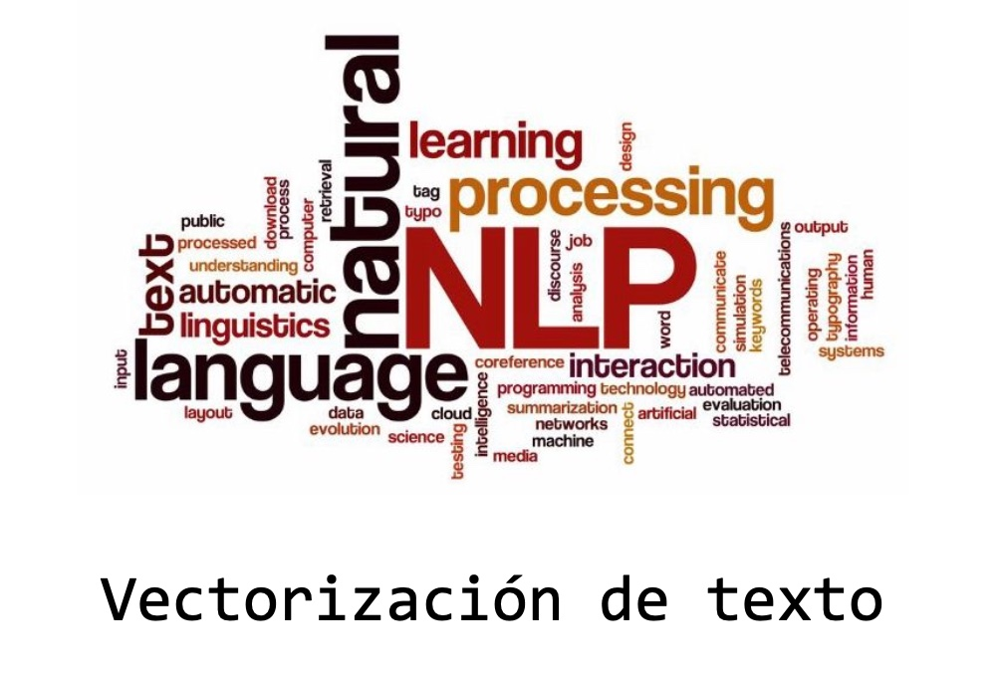
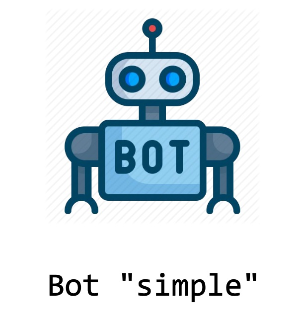
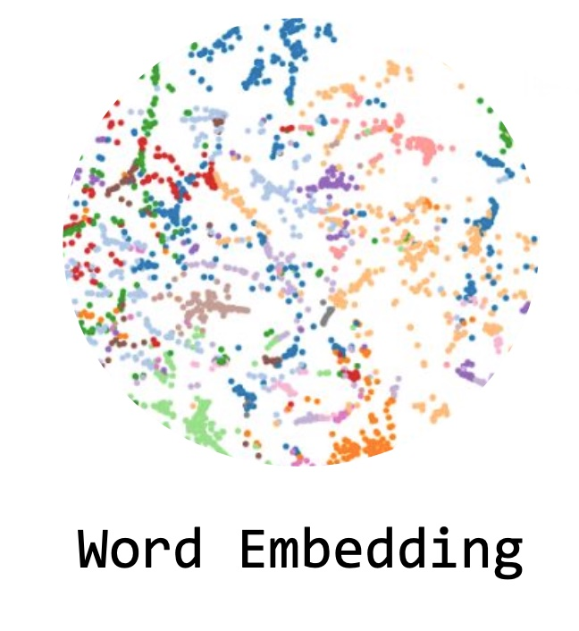

# Procesamiento Lenguaje Natural

A continuación se muestran los trabajos realizados en la Materia "Programación del Lenguaje Natural" del posgrado de especialización en Inteligencia Artificial. A lo largo de este curso, hemos explorado una amplia gama de temas que abarcan desde modelos introductorios para el manejo del lenguaje (NLP, por sus siglas en inglés) y la vectorización de documentos, hasta adentrarnos en el emocionante mundo de los Transformers y el fine-tuning con BERT & ELMo. En cada una de las clases desde la clase 1 a la clase 6 se plantearon los distintos desafíos que se debieron resolver. A través de esta plataforma, se presentan los resultados de dichos desafíos, ilustrando cómo se han aplicado los conocimientos adquiridos en la práctica. Lo invito a explorar libremente estos trabajos.

**DESAFIO 1** 
Vectorización de documentos.

En el primer trabajo, se llevaron a cabo varias tareas de introducción relacionadas con el procesamiento del lenguaje natural (NLP). En primer lugar, se realizó la obtención del vocabulario del corpus, que consistió en recopilar todos los términos utilizados en los documentos y crear un vector de términos no repetidos que abarcase todos los documentos. Luego, se implementaron diferentes técnicas de representación de texto:

**One-Hot Encoding**: Se creó una matriz que representaba la codificación "one-hot" de los documentos. Cada fila de la matriz correspondía a un documento y cada columna representaba un término único del vocabulario. La presencia de un término en un documento se marcaba con un '1' y su ausencia con un '0'.
**Vectores de Frecuencia**: Se generó otra matriz que representaba la frecuencia de cada término en los documentos. Cada fila de la matriz representaba un documento, y las columnas correspondían a términos del vocabulario. Cada celda contenía el número de veces que un término específico aparecía en un documento dado.
**TF-IDF (Term Frequency-Inverse Document Frequency)**: Se construyó una matriz que utilizaba la técnica TF-IDF para representar los documentos. Esta técnica tiene en cuenta tanto la frecuencia de un término en un documento como su importancia en el corpus general.

Además de estas representaciones de texto, se implementó una función para comparar documentos utilizando la similitud coseno. Esta función recibía el corpus y el índice de un documento y devolvía los documentos ordenados por su similitud coseno con respecto al documento de referencia. En resumen, el primer trabajo se centró en la obtención de representaciones de documentos y en la comparación de documentos utilizando medidas de similitud.
[a link]sdfsd(https://github.com/LucianoSmith/RCS/blob/main/desafio_1/desafio_1.ipynb)

# DESAFIO 2

# DESAFIO 3

# DESAFIO 4

# DESAFIO 5

# DESAFIO 6

