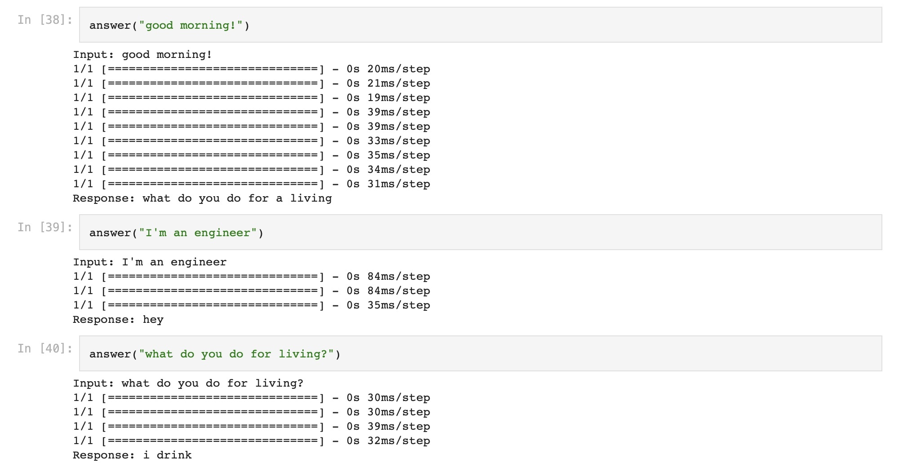

# Procesamiento Lenguaje Natural

A continuación se muestran los trabajos realizados en la Materia "Programación del Lenguaje Natural" del posgrado de especialización en Inteligencia Artificial. A lo largo de este curso, hemos explorado una amplia gama de temas que abarcan desde modelos introductorios para el manejo del lenguaje (NLP, por sus siglas en inglés) y la vectorización de documentos, hasta adentrarnos en el emocionante mundo de los Transformers y el fine-tuning con BERT & ELMo. En cada una de las clases desde la clase 1 a la clase 6 se plantearon los distintos desafíos que se debieron resolver. A través de esta plataforma, se presentan los resultados de dichos desafíos, ilustrando cómo se han aplicado los conocimientos adquiridos en la práctica. Lo invito a explorar libremente estos trabajos.

# Desafío 1

[Link al notebook](https://github.com/LucianoSmith/RCS/blob/main/desafio_1/desafio_1.ipynb)

En el primer desafío, se llevaron a cabo varias tareas de introducción relacionadas con el procesamiento del lenguaje natural (NLP). En primer lugar, se realizó la obtención del vocabulario del corpus, que consistió en recopilar todos los términos utilizados en los documentos y crear un vector de términos no repetidos que abarcase todos los documentos. Luego, se implementaron diferentes técnicas de representación de texto, utilizando **One-Hot Encoding**, **Vectores de Frecuencia** y 
**TF-IDF (Term Frequency-Inverse Document Frequency)**. Además de estas representaciones de texto, se implementó una función para comparar documentos utilizando la similitud coseno. Esta función recibía el corpus y el índice de un documento y devolvía los documentos ordenados por su similitud coseno con respecto al documento de referencia. 

# Desafío 2

[Link al notebook](https://github.com/LucianoSmith/RCS/blob/main/desafio_2/2b%20-%20bot.ipynb)

En el segundo desafío, se realizó un chatbot simple con respuestas preconfiguradas, aprovechando las  herramientas de PyTorch para la construcción de una red neuronal y Gradio para proporcionar una interfaz gráfica amigable. Se utilizó un dataset para el aprendizaje del algoritmo basado en las posibles respuestas a un cliente interesado en adquirir algún producto o servicio de una empresa proveedora de sistemas de correo neumático.

Ejemplos de respuestas obtenidas:

# DESAFIO 3

[Link al notebook](https://github.com/LucianoSmith/RCS/blob/main/desafio_3/desafio_3.ipynb)

En el tercer desafío, se crearon vectores de palabras utilizando Gensim, aprovechando los conceptos previamente aprendidos en clase. El dataset seleccionado consistió en los discursos más recientes del presidente. Durante el proceso, se exploraron términos de interés, se analizaron las similitudes en el espacio de embeddings y se plantearon pruebas de analogías. Además, se realizaron representaciones visuales de los embeddings resultantes las cuales se muestran a continuación.

# DESAFIO 4

[Link al notebook](https://github.com/LucianoSmith/RCS/blob/main/desafio_4/desafio_4.ipynb)

En el cuarto desafío, se continuó trabajando con el mismo dataset utilizado en el tercer desafío, y se implementaron estrategias de generación de secuencias many-to-one. Esto implicó la construcción de modelos que pudieran tomar una secuencia de palabras como entrada y generar una sola palabra o predicción como salida. Se exploraron arquitecturas, como las Redes Neuronales Bidireccionales (BRNN), para abordar esta tarea de generación de secuencias.

# DESAFIO 5

[Link al notebook](https://github.com/LucianoSmith/RCS/blob/main/desafio_5/desafio_5-2.ipynb)

En el quinto desafío, se aplicaron embeddings y redes neuronales recurrentes (LSTM) con el propósito de realizar análisis de sentimientos en críticas de compradores de ropa. Esta tarea involucró el procesamiento de texto y la construcción de un modelo de aprendizaje profundo capaz de clasificar automáticamente las críticas en tres categorías. El uso de embeddings permitió al modelo comprender mejor el contexto y las relaciones semánticas en el texto, mientras que las redes LSTM ayudaron a modelar las secuencias de palabras de manera efectiva. Este desafío representó un ejemplo valioso de cómo la inteligencia artificial puede ser aplicada en la evaluación automática de opiniones de los clientes en el ámbito de la moda y las compras.

# DESAFIO 6

[Link al notebook](https://github.com/LucianoSmith/RCS/blob/main/desafio_6/desafio_6.ipynb)

En el último desafío, se planteó la tarea de crear un bot de preguntas y respuestas (QA) utilizando una arquitectura de red neuronal NLP Encoder-Decoder. Para lograr esto, se emplearon las capacidades de LSTM (Long Short-Term Memory) y embeddings de Glove. El objetivo principal era construir un modelo que pudiera recibir preguntas en lenguaje natural y generar respuestas coherentes y significativas. Esta tarea demuestra cómo las técnicas de procesamiento de lenguaje natural, como las redes neuronales y los embeddings pre-entrenados, pueden aplicarse para crear sistemas de diálogo inteligentes y asistentes virtuales capaces de interactuar con usuarios de manera efectiva y contextual. A continuación, a modo de ejemplo, se pueden ver algunas respuestas del bot.

